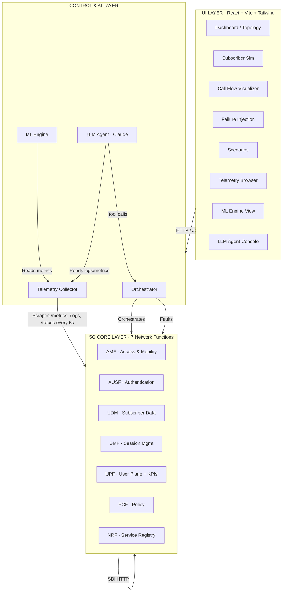
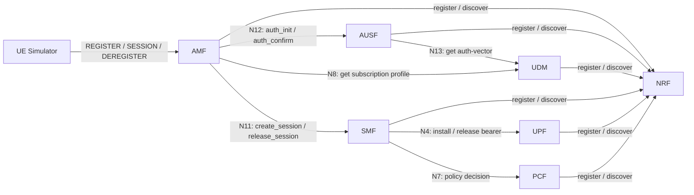
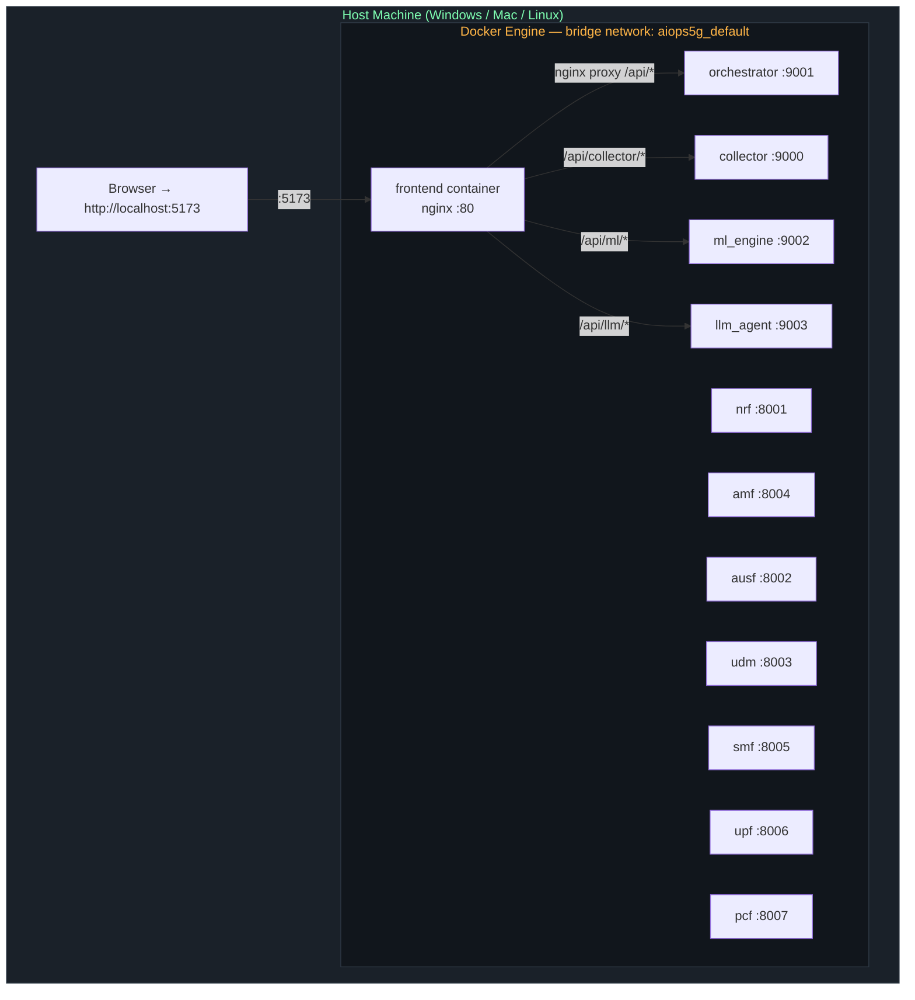
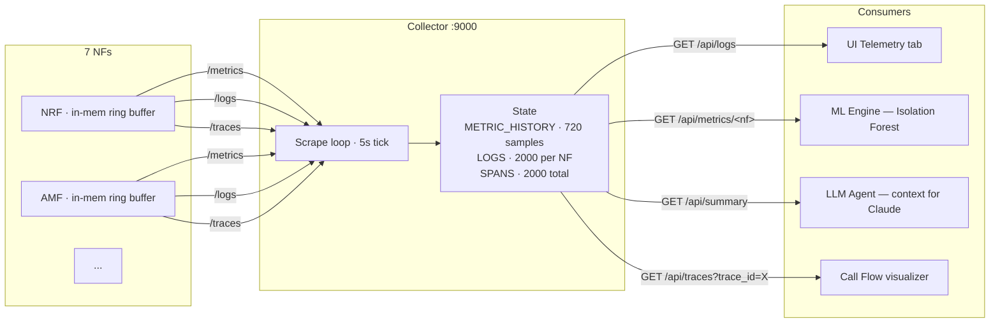
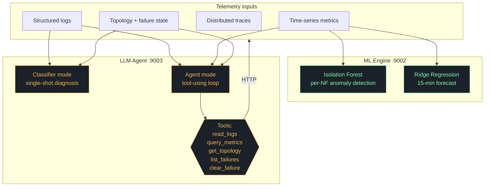

# Architecture — 5G AIOps

This document presents the system architecture from multiple viewpoints.
All Mermaid diagrams render natively on GitHub. ASCII versions are provided
as backup for offline viewing.

---

## 1. Logical Architecture

The system has three horizontal layers and three vertical stacks per layer.



**Layer responsibilities:**

| Layer | Owns | Talks To |
|-------|------|----------|
| UI | User interaction, visualization, no business logic | Control & AI layer only |
| Control & AI | Orchestration, telemetry aggregation, ML, LLM reasoning | Both UI (above) and 5G Core (below) |
| 5G Core | NF microservices, per-NF state, telemetry generation | Each other (SBI), Control layer (scraped) |

---

## 2. Service-Based Architecture (SBA) — Inter-NF Communication

Per 3GPP TS 23.501, all 5G NFs communicate via the Service-Based Interface (SBI) — RESTful HTTP calls. This implementation simplifies the SBI but preserves the topology.



ASCII version:

```
                                  ┌─────────────────────────┐
                                  │        NRF :8001        │
                                  │   (service registry)    │
                                  └────▲────▲────▲────▲─────┘
                                       │    │    │    │
        register/discover ─────────────┘    │    │    └────── register/discover
                                            │    │
                                       ┌────┴────┴────┐
                                       │ (all NFs)    │
                                       └──────────────┘

  UE                AMF :8004        AUSF :8002        UDM :8003
   │                   │                  │                 │
   │   REGISTER        │                  │                 │
   ├──────────────────▶│  N12:            │                 │
   │                   │  auth_init       │                 │
   │                   ├─────────────────▶│  N13:           │
   │                   │                  │  get auth-vec   │
   │                   │                  ├────────────────▶│
   │                   │                  │◀────────────────┤
   │                   │◀── challenge ────┤                 │
   │◀── RAND/AUTN ─────┤                  │                 │
   │── RES ───────────▶│                  │                 │
   │                   │  N12:            │                 │
   │                   │  auth_confirm    │                 │
   │                   ├─────────────────▶│                 │
   │                   │◀── ok ───────────┤                 │
   │                   │  N8: get profile                   │
   │                   ├───────────────────────────────────▶│
   │                   │◀───────────────────────────────────┤
   │◀── REGISTERED ────┤
   │                   │
   │   SESSION         │
   ├──────────────────▶│           SMF :8005       PCF :8007       UPF :8006
   │                   │  N11:        │               │               │
   │                   │  create      │               │               │
   │                   ├─────────────▶│   N7:         │               │
   │                   │              │   policy      │               │
   │                   │              ├──────────────▶│               │
   │                   │              │◀──────────────┤               │
   │                   │              │   N4:         │               │
   │                   │              │   install bearer              │
   │                   │              ├──────────────────────────────▶│
   │                   │              │◀──────────────────────────────┤
   │                   │◀── ok ───────┤
   │◀── ACTIVE ────────┤
```

---

## 3. Deployment Architecture (Docker Compose)



**Port mapping (host → container):**

| Service | Host port | Container port | Reason for renumbering |
|---------|-----------|----------------|------------------------|
| frontend | **5173** | 80 | unchanged — user-facing |
| nrf | 18001 | 8001 | avoids host port 8001 conflicts |
| ausf | 18002 | 8002 | same |
| udm | 18003 | 8003 | same |
| amf | 18004 | 8004 | same |
| smf | 18005 | 8005 | same |
| upf | 18006 | 8006 | same |
| pcf | 18007 | 8007 | same |
| collector | 19000 | 9000 | same |
| orchestrator | 19001 | 9001 | same |
| ml_engine | 19002 | 9002 | same |
| llm_agent | 19003 | 9003 | same |

Container-to-container traffic uses **container ports** (8001–8007, 9000–9003) via Docker DNS (`http://nrf:8001`, etc.). Host ports only matter when something outside Docker (your browser, curl from PowerShell) hits a service directly.

---

## 4. Telemetry Pipeline



**Data retention** (in-memory only — restarts wipe history):
- **Metrics**: 720 samples × 5s = 1 hour per NF
- **Logs**: 2000 most recent entries per NF
- **Spans**: 2000 most recent across all NFs

For production, replace the `Telemetry` class with OpenTelemetry SDK pointing at Loki + Prometheus + Tempo.

---

## 5. AI Layer Architecture



**Decision boundary:**

| Use ML when... | Use LLM when... |
|---|---|
| Metric is numeric and time-series | Reasoning needs to combine logs + metrics + topology |
| You need real-time scoring (<100ms) | You want explanations a human can read |
| You can label "normal" data | You want autonomous remediation |
| Pattern is statistical | Pattern is causal / requires multi-step investigation |

---

## 6. Data Flow Summary

| Flow | Trigger | Path | Outcome |
|------|---------|------|---------|
| **UE Attach** | Subscribers tab → Attach | UI → Orch → AMF → AUSF → UDM → AUSF → UDM → REGISTERED | UE state in AMF, log+span emitted |
| **PDU Session** | Subscribers tab → Attach (with session) | AMF → SMF → PCF (policy) → UPF (bearer) → ACTIVE | Bearer in UPF, KPIs update |
| **Failure injection** | Failures tab → Inject | UI → Orch → NF `/failure` endpoint | NF middleware applies fault on every subsequent request |
| **Scenario** | Scenarios tab → Run | UI → Orch → scenarios.py task → orchestrates injects + load | Multi-phase chaos with logged transcript |
| **ML scan** | ML tab → Scan | UI → ml_engine → collector → Isolation Forest | Per-NF anomaly list with scores |
| **LLM diagnose** | Agent tab → Diagnose | UI → llm_agent → collector + orchestrator → Claude API | Structured diagnosis JSON |
| **LLM remediate** | Agent tab → Start agent | UI → llm_agent → Claude → tool calls → orchestrator/collector | Autonomous investigation + cleared faults |
| **Call flow trace** | Call Flow tab → Trace | UI → Orch (assigns trace_id) → AMF (with X-Trace-Id) → all NFs propagate | Spans recorded, retrievable by trace_id |

---

## 7. Failure Domains

What happens when each component fails:

| Component fails | Impact | Mitigation in this design |
|---|---|---|
| **NRF** | Service discovery breaks; new NFs can't register | Each NF caches URLs from env vars; NRF used only for visibility |
| **AUSF** | All new UE registrations fail at auth step | LLM agent detects via `auth_init_failures_total` spike |
| **UDM** | Auth vectors fail + profile lookups fail | High blast radius — both AUSF and AMF affected |
| **AMF** | Entire UE access plane down | Critical — also affects deregistrations |
| **SMF** | No new PDU sessions; existing UEs stay registered | Distinct symptom (sessions ↓ but UEs steady) |
| **PCF** | SMF can't get policies → sessions stuck PENDING | Sessions never reach ACTIVE — clear UI signal |
| **UPF** | No bearers can be installed; KPIs stop updating | Data plane impact, see policy-blackhole / upf-overload scenarios |
| **Collector** | UI loses telemetry but NFs unaffected | Read-only — degraded observability, no functional impact |
| **Orchestrator** | UI controls fail; can't inject faults or run scenarios | NFs continue running |
| **ML Engine** | Anomaly detection unavailable | Pure consumer — no impact on NFs |
| **LLM Agent** | Cannot run diagnosis/remediation | Classifier mode also unavailable |
| **Frontend** | UI down | Backend fully accessible via curl/Swagger UI |

This is one reason the system is fault-tolerant by design — most failures are isolated to their component.
