# Message Flows — 5G AIOps

Detailed sequence diagrams for every flow in the system. All diagrams are Mermaid (renders on GitHub) with ASCII backups for offline viewing.

**Index:**
- [§1 UE Registration (Attach)](#1-ue-registration-attach)
- [§2 PDU Session Establishment](#2-pdu-session-establishment)
- [§3 UE Deregistration (Detach)](#3-ue-deregistration-detach)
- [§4 Failure Injection](#4-failure-injection)
- [§5 Failure Scenario Execution](#5-failure-scenario-execution)
- [§6 Telemetry Collection](#6-telemetry-collection)
- [§7 ML Anomaly Detection](#7-ml-anomaly-detection)
- [§8 LLM Classifier Diagnosis](#8-llm-classifier-diagnosis)
- [§9 LLM Agent Tool Loop](#9-llm-agent-tool-loop)
- [§10 Call Flow Tracing](#10-call-flow-tracing)
- [§11 NF Service Registration](#11-nf-service-registration)

---

## 1. UE Registration (Attach)

### Trigger
- **UI**: Subscribers tab → "Attach 10 UEs"
- **API**: `POST /api/orchestrator/subscribers/attach`

### Flow

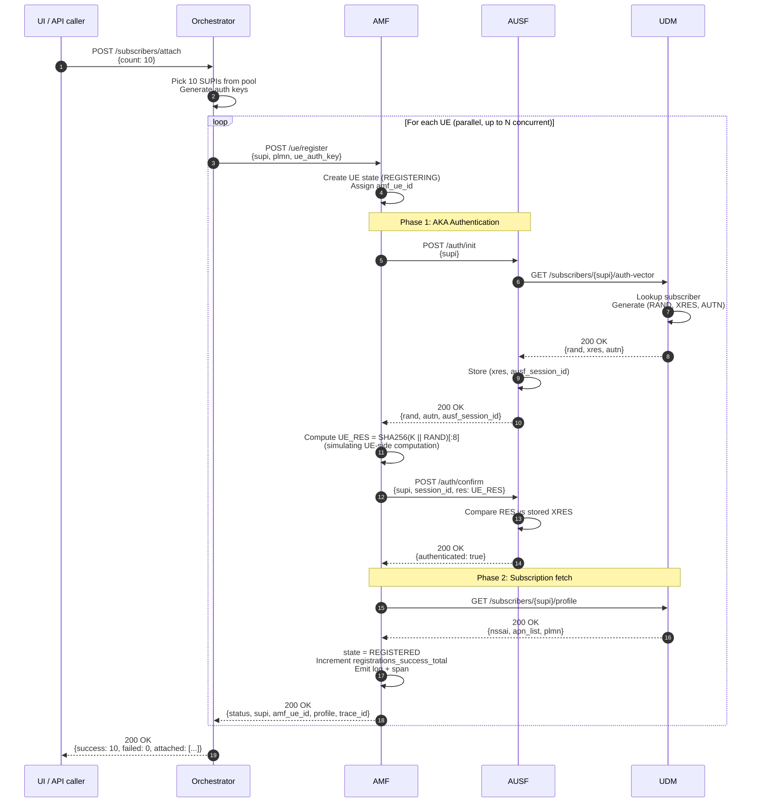

### Error paths

| Failure point | What happens | Status code | LLM agent symptom |
|---------------|-------------|-------------|-------------------|
| UDM auth-vector fetch fails | AUSF returns 500 → AMF returns 503 | 503 | `auth_init_failures_total` ↑ |
| AUSF compares RES, mismatch | `auth_confirm_failures_total++` | 401 | log: "auth confirmation failed" |
| UDM profile fetch fails | AMF returns 503 | 503 | `registrations_failed_total` ↑ |
| AMF middleware (injected fault) | Returns 500 before any logic | 500 | request never reaches AUSF |

### Telemetry generated per attach

- **Spans**: 7 per successful attach (AMF root, 6 inter-NF calls)
- **Logs**: ~5 (REGISTERING, auth init, auth confirm, profile fetch, REGISTERED)
- **Metrics**: `requests_total++`, `registrations_success_total++`, `active_ues` gauge updated
- **Trace context**: `trace_id` propagated via `X-Trace-Id` header end-to-end

### ASCII version

```
UI         Orchestrator    AMF           AUSF          UDM
 │              │            │              │             │
 │POST /attach │            │              │             │
 │─────────────▶            │              │             │
 │              │POST/register             │             │
 │              │────────────▶              │             │
 │              │            │ POST/auth/init             │
 │              │            │─────────────▶              │
 │              │            │              │GET/auth-vec│
 │              │            │              │────────────▶
 │              │            │              │◀─(rand,xres,autn)
 │              │            │◀─(rand,autn) │             │
 │              │            │POST/auth/confirm           │
 │              │            │─────────────▶              │
 │              │            │◀── ok ───────              │
 │              │            │GET /profile  │             │
 │              │            │───────────────────────────▶│
 │              │            │◀──────────────(nssai,apn) │
 │              │            │ REGISTERED   │             │
 │              │◀───────────│             │             │
 │◀─────────────│            │              │             │
```

---

## 2. PDU Session Establishment

### Trigger
- **UI**: Same as attach (the orchestrator does attach + session in one call)
- **Direct API**: `POST /ue/session` on AMF

### Flow

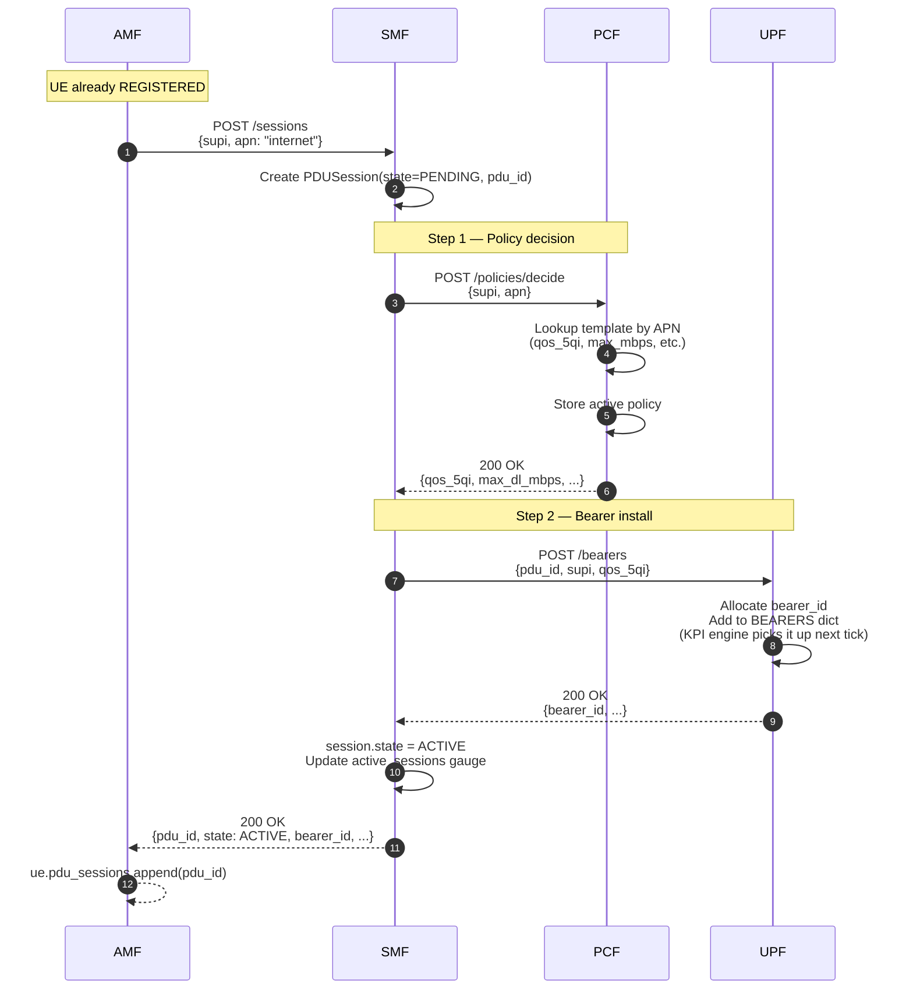

### Error handling — what makes this realistic

If **PCF** fails:
1. SMF logs `pcf_error`, increments `sessions_failed_total{reason="pcf_error"}`
2. Session state stays `PENDING` (later marked FAILED)
3. SMF returns 503 to AMF
4. **No UPF call is made** — bearer wasn't installed

If **UPF** fails after PCF succeeded:
1. SMF logs `upf_error`
2. Best-effort cleanup: SMF calls `DELETE /policies/{supi}` on PCF to roll back
3. Session state = FAILED
4. SMF returns 503

This rollback pattern is exactly what real telco SMFs do. The LLM agent can detect both signatures: "policy issued but no bearer" vs "no policy at all" indicates *which* downstream NF failed.

### KPI propagation

Once a bearer is installed, UPF's KPI engine (1Hz background loop) starts including it in:
- `total_dl_mbps` += per-bearer rate (depends on 5QI)
- `active_bearers` gauge += 1
- `bearers_5qi_<N>` gauge += 1

Visible in Topology tab's "UPF Data Plane KPIs" panel within 1 second.

---

## 3. UE Deregistration (Detach)

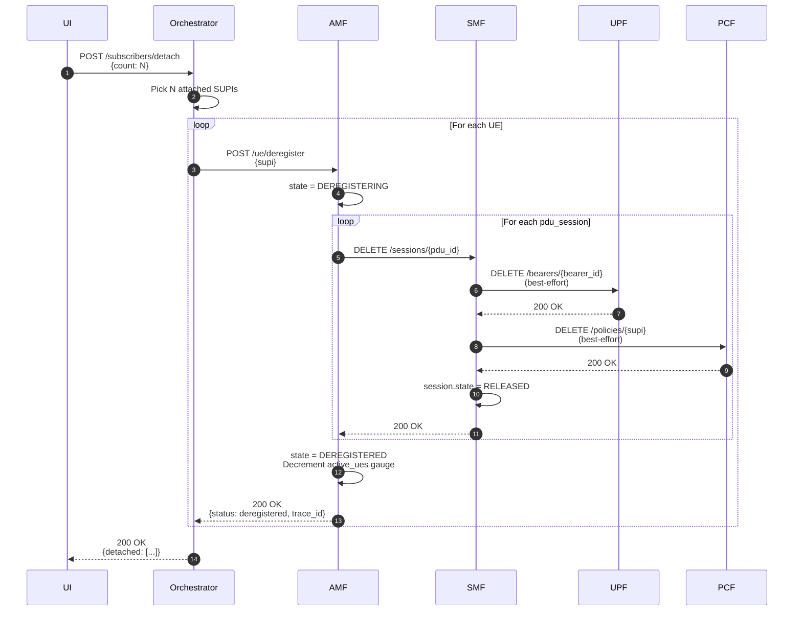

**Cleanup philosophy**: best-effort. If UPF/PCF fail during cleanup, AMF still marks the UE as DEREGISTERED. Better to have orphan bearers/policies than zombie UEs blocking re-attach.

---

## 4. Failure Injection

```mermaid
sequenceDiagram
    autonumber
    participant UI
    participant ORCH as Orchestrator
    participant TARGET as Target NF (e.g. AMF)

    UI->>ORCH: POST /failures/inject<br/>{nf: "amf", error_rate: 0.5, extra_latency_ms: 1000}
    ORCH->>ORCH: Validate request<br/>Look up target NF URL
    ORCH->>TARGET: POST /failure<br/>{error_rate: 0.5, extra_latency_ms: 1000}
    TARGET->>TARGET: Update failure_config<br/>(in-memory)
    TARGET-->>ORCH: 200 OK<br/>{updated_config}
    ORCH-->>UI: 200 OK

    Note over TARGET: All subsequent requests now run through<br/>middleware that applies the config

    rect rgb(40, 30, 30)
        Note over TARGET: Effect on next request
        participant CALLER as Some other NF
        CALLER->>TARGET: GET /healthz (or any endpoint)
        TARGET->>TARGET: Middleware:<br/>1. sleep extra_latency_ms<br/>2. coin-flip on error_rate<br/>3. coin-flip on corruption_rate
        alt error_rate triggered
            TARGET-->>CALLER: 500 Internal Server Error
        else corruption_rate triggered
            TARGET-->>CALLER: 200 OK<br/>{...mangled body...}
        else normal
            TARGET-->>CALLER: 200 OK
        end
    end
```

### Fault config schema

```json
{
  "error_rate": 0.0,         // 0.0–1.0, returns HTTP 500 with this probability
  "extra_latency_ms": 0,     // added to every request (sync sleep)
  "blackhole": false,        // hangs request 30s then 503 (simulates timeout)
  "corruption_rate": 0.0,    // returns mangled response body
  "unhealthy": false         // /healthz returns 503 but service responds otherwise
}
```

---

## 5. Failure Scenario Execution

Scenarios are scripted multi-step sequences. Example: `auth-storm`.

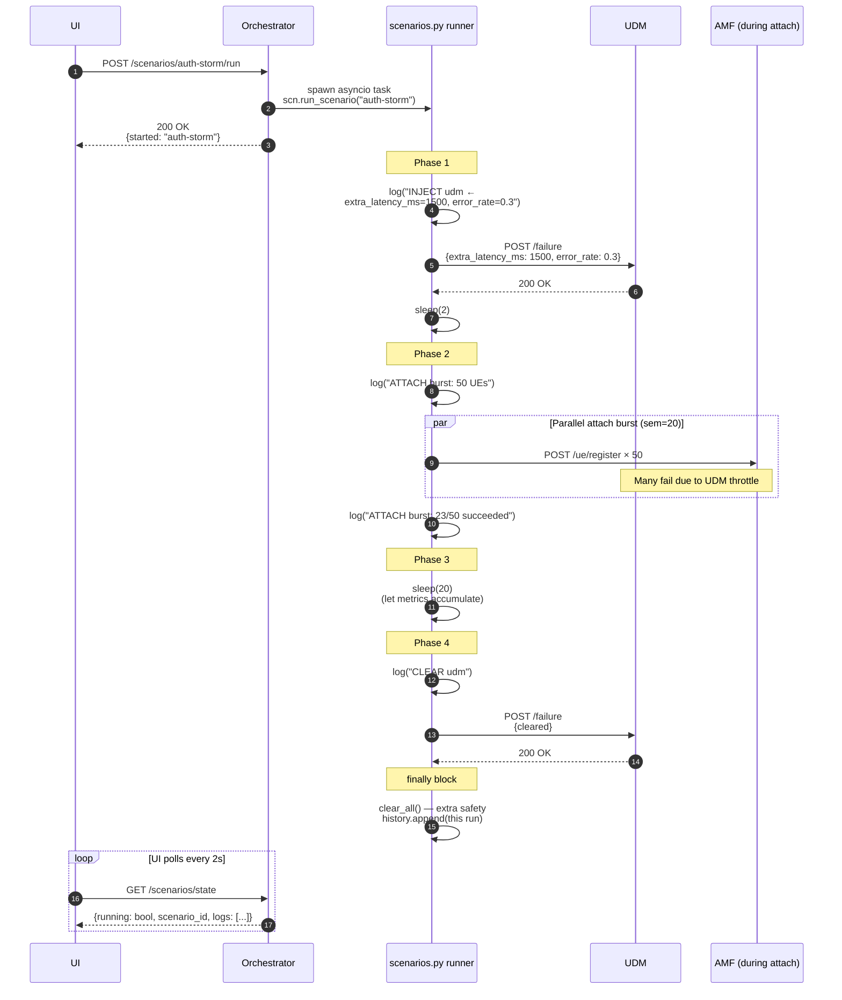

**Cancellation**: If UI clicks "Stop" or another scenario is started, the `asyncio.Task` is cancelled. The `finally` block always clears all faults — guaranteed clean state after every scenario.

---

## 6. Telemetry Collection

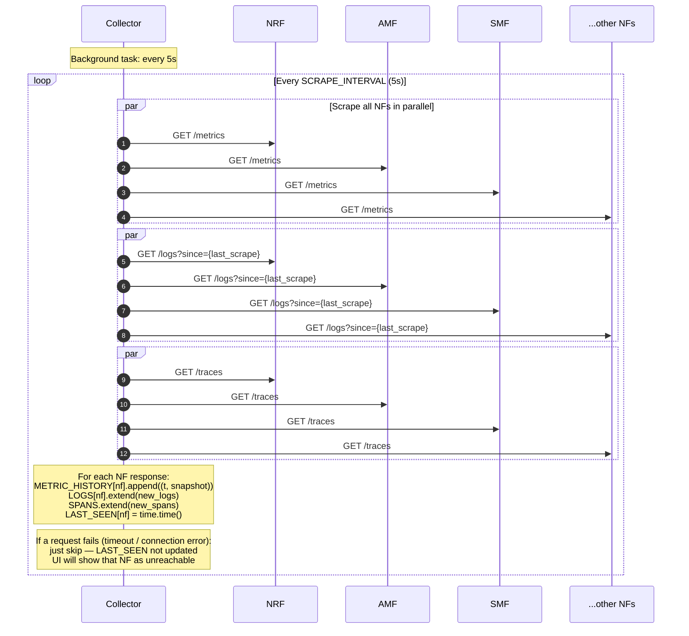

**Why poll instead of push?** Polling is simpler, the NFs don't need to know about the collector, and 5s is fine granularity for a simulator. Production systems would push via OpenTelemetry OTLP exporter.

---

## 7. ML Anomaly Detection

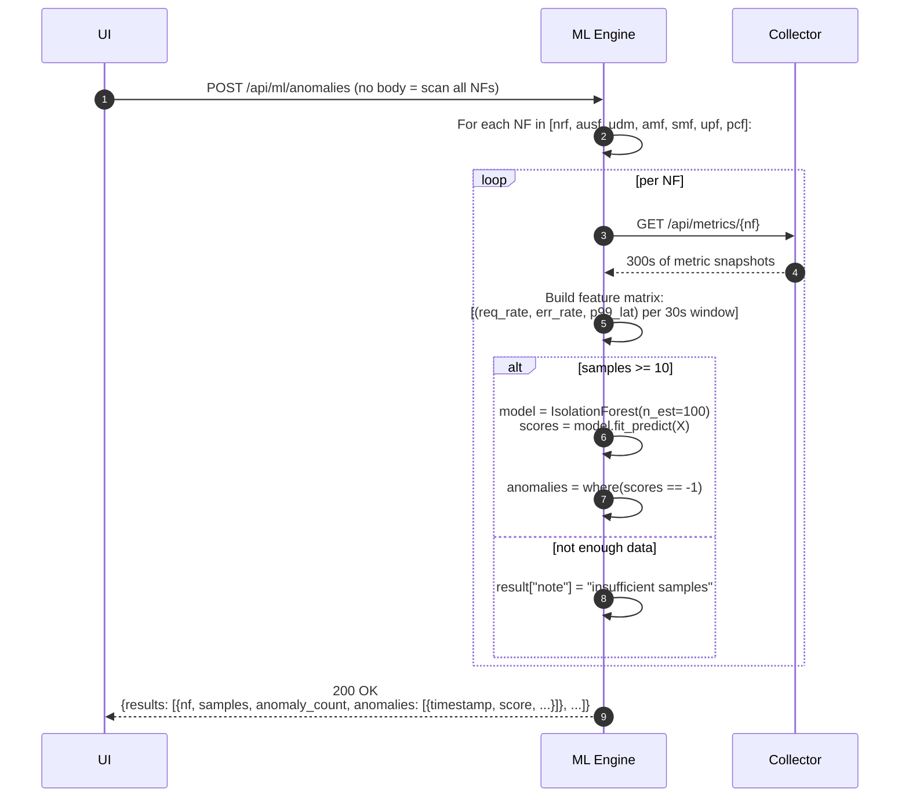

**Why Isolation Forest?**
- No labels needed (unsupervised)
- Handles multivariate data (3 features per sample)
- Fast — fits 100 trees on ~50 samples in <100ms
- Anomalies are "easy to isolate" — high scoring points get fewer splits

**When it works well**: sudden, large deviations from baseline (e.g. error rate jumps from 0.1% to 30%).

**When it doesn't**: gradual drift (use Ridge forecast for that), or anomalies that look like normal spikes (use rate-of-change features instead).

---

## 8. LLM Classifier Diagnosis

Single-shot Claude call. No tools. Returns structured JSON.

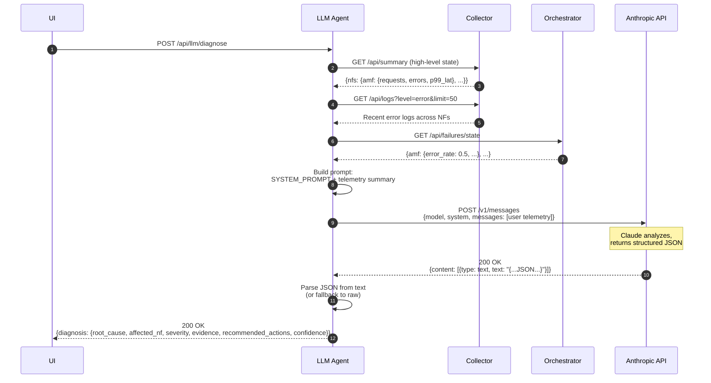

### Prompt skeleton

```
System: You are a 5G network SRE. You analyze telemetry from a microservice
5G core (NRF, AUSF, UDM, AMF, SMF, UPF, PCF) and identify root causes.

The 5G registration flow is: UE → AMF → AUSF → UDM ...
Common failure modes: ...

Respond ONLY with JSON matching this schema:
{
  "root_cause": str,
  "affected_nf": str,
  "severity": "low" | "medium" | "high" | "critical",
  "evidence": [str],
  "recommended_actions": [str],
  "confidence": float (0-1)
}

User: Here is the current 5G core telemetry:
TOPOLOGY: { ... }
METRICS SUMMARY: { ... }
RECENT ERROR LOGS (last 50): [ ... ]
INJECTED FAILURES: { ... }

Diagnose any active issues.
```

---

## 9. LLM Agent Tool Loop

The autonomous mode. Claude decides what to investigate, calls tools, observes results, decides what to do next. Loops until it stops calling tools.

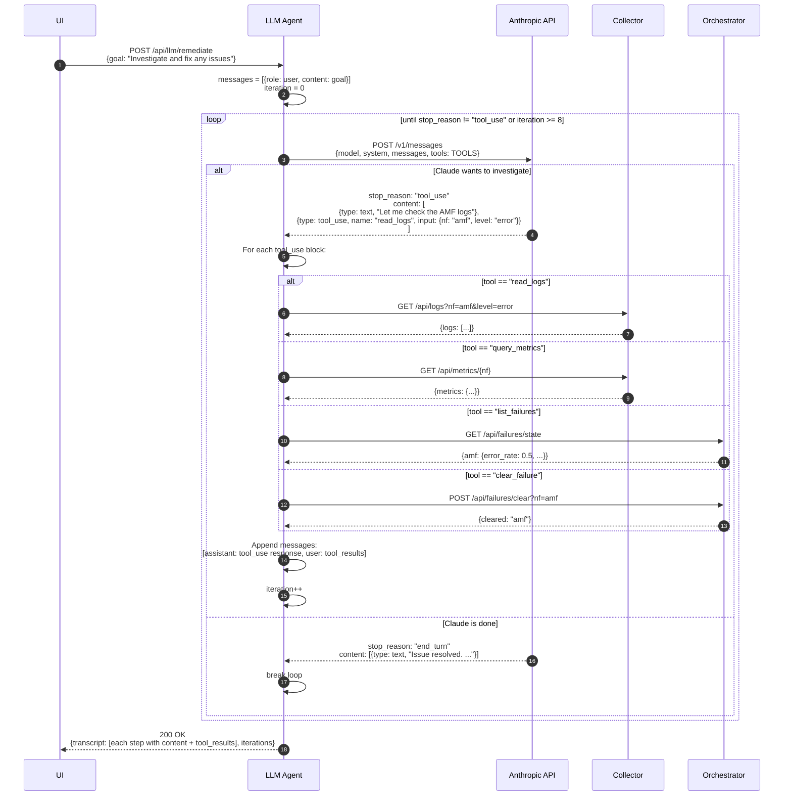

### Real example transcript (annotated)

```
ITERATION 1 (stop_reason: tool_use)
  text: "I'll start by checking the topology and any active failures."
  tool_use: get_topology
  tool_use: list_failures

  → tool_results: {topology: ..., failures: {amf: {error_rate: 0.5}}}

ITERATION 2 (stop_reason: tool_use)
  text: "I see a 50% error rate injected on AMF. Let me check its logs."
  tool_use: read_logs(nf="amf", level="error")

  → tool_results: {logs: ["registrations_failed_total++", ...]}

ITERATION 3 (stop_reason: tool_use)
  text: "Confirmed: AMF is the issue. Clearing the fault."
  tool_use: clear_failure(nf="amf")

  → tool_results: {cleared: "amf"}

ITERATION 4 (stop_reason: tool_use)
  text: "Verifying recovery..."
  tool_use: list_failures

  → tool_results: {} (empty)

ITERATION 5 (stop_reason: end_turn)
  text: "## Summary
         - Root cause: 50% error_rate fault injected on AMF
         - Action: cleared the fault via clear_failure(amf)
         - Verification: list_failures confirms no active faults
         - System is healthy."
```

---

## 10. Call Flow Tracing

The Call Flow visualizer triggers a flow with a known trace_id, then reconstructs the sequence diagram from spans.

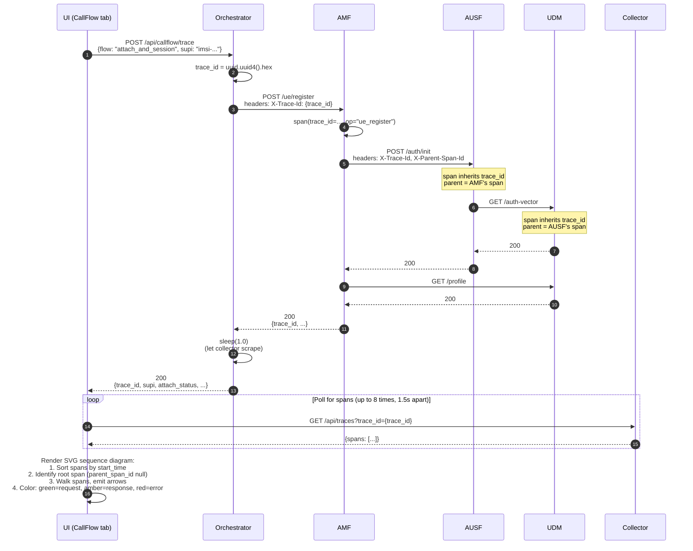

### Span tree for a successful attach + session

```
ue_register (AMF)                        [trace_id=X, span=A, parent=null]
├── call_ausf_/auth/init (AMF)          [trace_id=X, span=B, parent=A]
│   └── auth_init (AUSF)                [trace_id=X, span=C, parent=B]
│       └── call_udm_/auth-vector (AUSF)[trace_id=X, span=D, parent=C]
│           └── get_auth_vector (UDM)   [trace_id=X, span=E, parent=D]
├── call_ausf_/auth/confirm (AMF)       [trace_id=X, span=F, parent=A]
│   └── auth_confirm (AUSF)             [trace_id=X, span=G, parent=F]
└── call_udm_/profile (AMF)             [trace_id=X, span=H, parent=A]
    └── get_profile (UDM)               [trace_id=X, span=I, parent=H]
```

The CallFlow.jsx renderer turns this into the sequence diagram by walking child spans of root in start_time order and emitting arrows for each `call_<nf>_*` span.

---

## 11. NF Service Registration

Happens once at NF startup. Demonstrated with AMF, applies to all NFs.

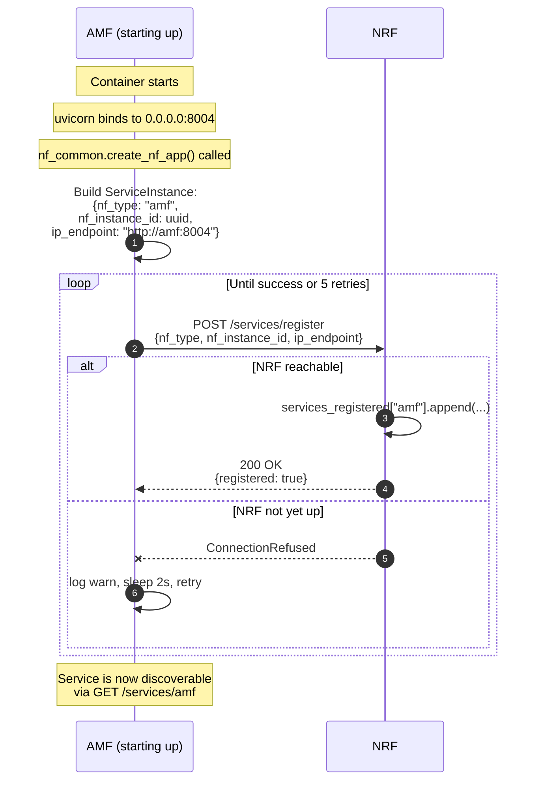

**docker-compose `depends_on`** ensures NRF starts first and is healthy (via its `/healthz` healthcheck) before any other NF tries to register. So in practice retries rarely happen, but the code handles transient NRF outages anyway.

---

## Appendix: How to read these diagrams

- **Solid arrow** (`-->`): synchronous request
- **Dashed arrow** (`-->>`): response
- **`Note over X,Y`**: behavior or state change
- **`alt/else`**: conditional branches
- **`par`**: parallel execution
- **`loop`**: iteration
- **`rect`**: visual grouping for emphasis
- **autonumber**: each step gets a sequential number for easy reference

For the ASCII versions, vertical lines are NF lifelines (time flows downward), horizontal arrows are messages.
